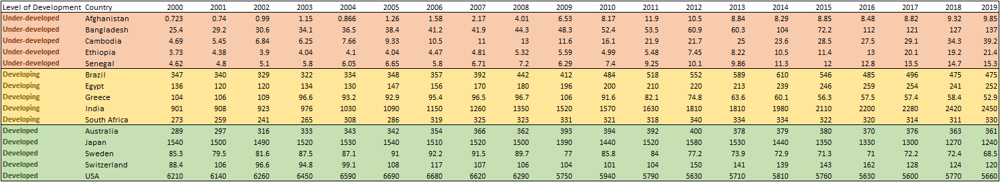
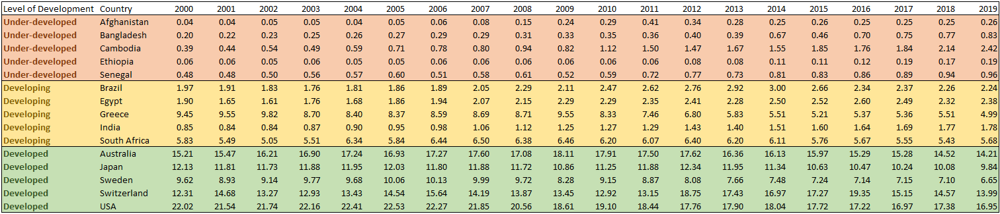
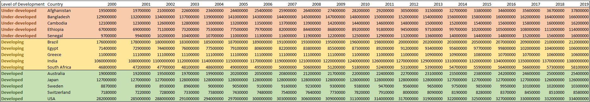
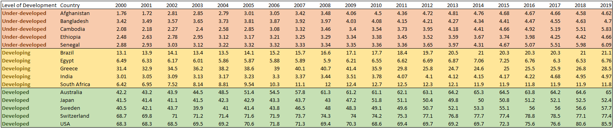

# Group-3-Project-3
Group 3 Project 3 - Huang, Potter, Bhardwaj, Robertson

## Analysis

The inention of this project was to take CO2 emissions data and measure it against certain economic markers to generate a snapshot of a countries environmental impact vs economic efficiency for first two decades at the turn of the millenium. 

Data was accessed from Gapminder, a publicly available database of information containing historic and projected social, economic & environmental datasets. A sample of 15 countries were selected to create a global summary. Groups of five countries were selected to represent a selection from three distinct market classifications:

- Developed
  - Australia
  - USA
  - Sweden
  - Switzerland
  - Japan
  - 
- Underdeveloped
  - Brazil
  - Egypt
  - Greece
  - India
  - South Africa
  
- Developing
  - Bangladesh
  - Afghanistan
  - Cambodia
  - Senegal
  - Ethiopia

We analysed 2 emissions data metrics:

  #### Annual CO2 Emissions Total (Millions of Tonnes)

  #### Annual CO2 Emissions Per Capita (Tonnes)

And 3 economic markers:

  #### Population
  

  #### Average Daily income ($USD)
  

  #### Country GDP (Millions of $USD)
  

The data was

## Ethical Considerations

When collecting data one must consider a variety of ethical implications at all stages of the analytical process including collection, processing, analysis and presentation of data. Some of the key points to take into consideration include:

- Privacy concerns
- Inherent bias or prejudice
- Transparency
- Data security
- Consideration of outcomes
  
In this project we explored free, publicly available country data for emissions, gdp, population and economic strength. These types of information are widely considered unbias and pose little ethical risk as they are an objective point of information compiled for a variety of domestic and international reporting.

The purpose for colecting, analysing and visualising the information was to investigate countries classified as developed, developing or underveloped and generate a preview of their CO2 emissions against economic markers. This preview would give us insight into the economic efficiency vs environmental impact and the carbon intensity of each country relative to GDP of each classification. 

The risk you run with presenting data in this manner is that that out of context conclusions could be drawn. A countries relationship between it's economic output and emissions levels are open to so many other contributing factors that it would be impossible to draw any real meanngful conclusion to infulence decision making. One reliable metric which could be gathered from this data are countries which would benefit from foreign investment into greener manufacturing and production projects or countries. This could improve domestic econimic measures and assist in reducing the growth in CO2 emissions moving forward.

## References

- *How To Create a Top Navigation Bar*, (1999 - 2024) W3Schools, https://www.w3schools.com/howto/howto_js_topnav.asp
- *MSCI Market Classification: Assessing and categorizing equity markets according to common characteristics*, MSCI, https://www.msci.com/our-solutions/indexes/market-classification
- *Global Carbon Budget (2023); Population based on various sources (2023) – with major processing by Our World in Data. “Per capita CO₂ emissions – GCB” [dataset]*. Global Carbon Project, “Global Carbon Budget”; Various sources, “Population” [original data].  https://ourworldindata.org/grapher/co-emissions-per-capita
- *CO2 emissions per capita Consumption based, tonnes per capita* & *GDP per capita (Price and inflations adjusted, in PPP$2017)* & *Population* & *Consumption CO2 emissions, million tonnes* & *Average daily income, $/person/day, inflation - & price adjusted*, https://www.gapminder.org/data/
- *Natural Earth   &raquo; 1:10m Cultural Vectors - Free vector and raster map data at 1:10m, 1:50m, and 1:110m scales*, 2009 - 2024. Natural Earth https://www.naturalearthdata.com/downloads/10m-cultural-vectors/
- Gillies S *shapely.MultiPolygon &#8212; Shapely 2.1.0.dev0 documentation*, Shapely https://shapely.readthedocs.io/en/latest/reference/shapely.MultiPolygon.html
- GeoPandas developers *User Guide*, GeoPandas 2013–2022 https://geopandas.org/en/stable/docs/user_guide.html
- *Human Development Index (HDI),© 2024* United Nations Development Programme - https://hdr.undp.org/data-center/human-development-index#/indicies/HDI
- *Top 25 Developed and Developing Countries, December 17, 2023* - https://www.investopedia.com/updates/top-developing-countries/
- *Ethiopia Looks to Tap Its Massive Renewable Energy Potential, Feb 18, 2024* - https://oilprice.com/Alternative-Energy/Renewable-Energy/Ethiopia-Looks-to-Tap-Its-Massive-Renewable-Energy-Potential